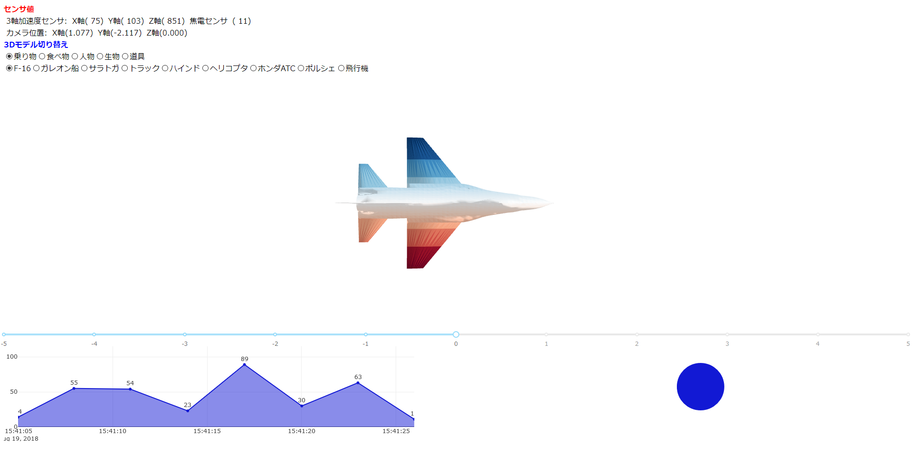

# Sensor_view
## 表示画面


## 動作環境
- ### Python3.0以上が動作するPC

## ダウンロード
```
$ git clone https://github.com/s4i/Sensor_view.git
```

## 起動方法(Linux)
### 1. (管理者権限)virtualenv のインストール
```
$ pip3 install virtualenv
```

### 2. Python3仮想環境でpip install
```
$ cd Sensor_view
$ virtualenv env/python
$ python_env=env/python/bin
$ $python_env/pip install -r requirements.txt
```
 - **`$python_env`はログオフと同時に消える**

### 3. Webサーバ起動
```
$ $python_env/python app.py
```

### 4. ブラウザから接続
```
http://localhost:5000/
```

### 仮想環境削除
```
$ rm -r env
```